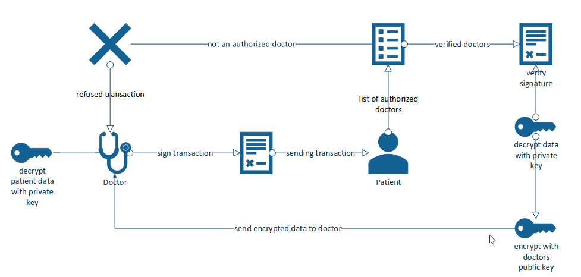

# Network Concept
These Python programs illustrate the basic concept of how networking would function between two nodes, namely the patient and HCP. 
The programs in the HCP folder are needed to run the HCP node. The ones in the patient folder run the patient node. Each will have 
there own README files to assist in testing and understanding how they work. This is not a fully functioning decentralized system, 
instead it is a prototype/concept on how two nodes would interact in a decentralized network.

# peer-to-peer Network diagram

Here is a diagram that examples how the two nodes (patient and doctor) interact. This diagram showcases the doctor requesting access to the patients data. In the terminal, this would be equivilant to first running server.py in the patient folder, than running the doctor client using view_block.py.

here is a quick demonstration
patient machine
```bash
# first go to the patient folder
$ cd patient 
# then run server.py
$ python server.py
# for more information on how view_block.py works and how to use it, check the README file in the patient folder
```

doctor machine 
```bash
# once you have the patients node active you can now run the doctor node
$ cd doctor 

$ python view_block.py
# for more information on how view_block.py works and how to use it, check the README file in the doctor folder
```




